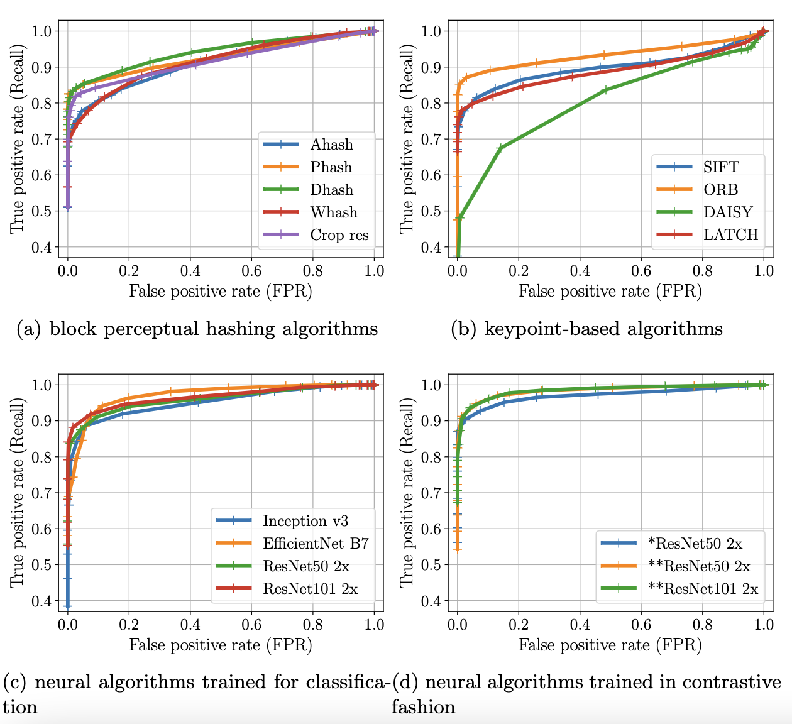
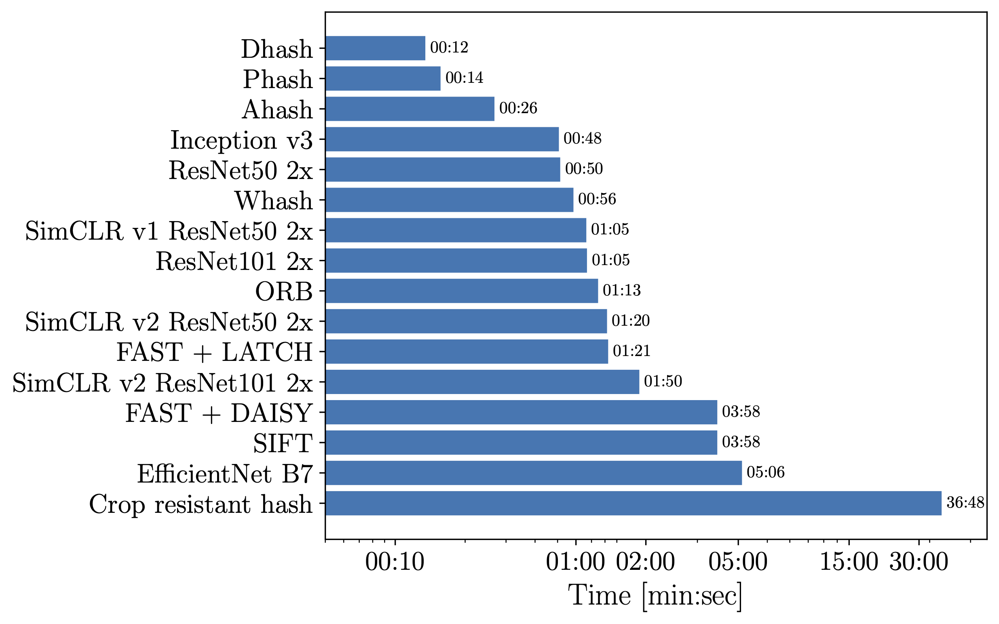

# Image manipulation detection

A library for image manipulation detection. This supports 3 classes of algorithms :

- Perceptual hashing methods (fast and simple methods designed for image forensics). The following algorithms are implemented in `hashing/imagehash.py` (taken and modified from [here](https://github.com/JohannesBuchner/imagehash)):
    - Average Hash
    - Perceptual hash
    - Difference hash
    - Wavelet hash
    - Crop resistant hash
    - Color hash
    - Histogram hash


- Features extractors and descriptors (designed for object/scene retievals). The following algorithms are supported in `hashing/featurehash.py` :
    - SIFT
    - ORB
    - FAST + LATCH
    - FAST + DAISY


- Neural networks (deep CNNs) whose features from last layers have been shown to provide high descriptors of the image (regardless of the specific task the network was designed for, e.g classification). The following architectures are supported (note that each network was pretrained on ImageNet either for classification or by contrastive self-supervised learning) in `hashing/neuralhash.py`:
    - inception v3 (classification)
    - EfficientNet B7 (classification)
    - ResNets with different depth and width multipliers (classification)
    - SimCLR ResNets (contrastive learning). Link to [paper](https://arxiv.org/abs/2002.05709) and [github](https://github.com/google-research/simclr).

The specific goal here is more to detect crude near duplicate image manipulations than to perform object or scene retrival.

<p align="center">
   
  <br>
    <em>Overall performances for each method on the BSDS500 dataset and artificial attacks</em>
</p>

# Usage


This library was created to benchmark all these different methods. The easiest way for this is to choose a dataset, randomly split it in 2 parts (experimental and control groups), and sample a given number of images in both groups on which you can perform artificial attacks defined in `generator/generate_attacks.py`. The scripts `create_groups.py` and `create_attacks.py` perform those tasks, and save the images with correct name format for later matching.

Then given a database of images, an experimental group of images that are manipulations of some images in the database (all attacks on the images sampled from experimental group) and a control group containing images not present in the database (all attacks on the images sampled from control group), datasets can be declared in the following way :

```
import hashing 
from helpers import utils

path_database = 'Datasets/BSDS500/Experimental/'
path_experimental = 'Datasets/BSDS500/Experimental_attacks/'
path_control = 'Datasets/BSDS500/Control_attacks/'

positive_dataset = hashing.create_dataset(path_experimental, existing_attacks=True)
negative_dataset = hashing.create_dataset(path_control, existing_attacks=True)
```

Additionally, if one wants to perform attacks at experiment time, without having to save them to disk (experiment will take more time but this will save storage space), it can be done as

```
path_dataset = 'Datasets/...'

dataset = hashing.create_dataset(path_dataset, fraction=0.3, existing_attacks=False):
```

where `fraction` is the fraction of the dataset on which attacks will be performed (give 1 for each image in the dataset).

Then declare the methods and algorithms you wish to use, along with thresholds for the matching logic, e.g :

```
algos = [
        hashing.ClassicalAlgorithm('Phash', hash_size=8),
        hashing.FeatureAlgorithm('ORB', n_features=30),
        hashing.NeuralAlgorithm('SimCLR v1 ResNet50 2x', device='cuda', distance='Jensen-Shannon')
        ]

thresholds = [
    np.linspace(0, 0.4, 20),
    np.linspace(0, 0.3, 20),
    np.linspace(0.3, 0.8, 20),
    ]
```

Finally perform the benchmark and save the results :

```
save_folder = utils.parse_input()

digest = hashing.total_hashing(algos, thresholds, path_database, positive_dataset, negative_dataset, general_batch_size=64)
                               
utils.save_digest(digest, save_folder)
```

All this is contained in `main.py`. 

The final digest is composed of 6 files : `general.json` with general metrics for all the experiment, `attacks.json` containing the metrics for each types of attack, `images_pos.json` and `images_neg.json` containing number of correct/incorrect detection for each image in the database respectively, and `match_time.json` and `db_time.json` respectively containing the time (s) for the matching phase and the the database creation phase.

# Figure generation

To process and create figures from the digest, one can look into `process.py`. Figure generation is contained in `helpers/create_plot.py`. Note that by default this will require a LaTeX installation on the machine running the process. This can be disabled in `helpers/configs_plot.py`.

# Datasets

We personally used 3 datasets that can be found online, and for which we performed the splitting. They are the [BSDS500 dataset](https://www2.eecs.berkeley.edu/Research/Projects/CS/vision/grouping/resources.html), [ImageNet validation set (ILSVRC2012)](https://www.image-net.org/) and the [Kaggle memes dataset](https://www.kaggle.com/datasets/gmorinan/most-viewed-memes-templates-of-2018).

# Pre-trained SimCLR models 

The pre-trained SimCLR models are not available in this repository due to their large size. They can be downloaded (along with their architecture definition) directly in the [github of the authors ](https://github.com/google-research/simclr). Note that we used the PyTorch version of these models. They should then be added to `hashing/SimCLRv1/` and `hashing/SimCLRv2/` (folders SimCLRv1 and SimCLRv2). If unsure, see how these models are loaded directly in `hashing/neuralhash.py`.

# Computational setup

For neural methods, use of a GPU is almost essential for computational efficiency. Other classes of methods do not rely on it, and their computations are performed exclusively on CPU.
